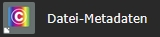
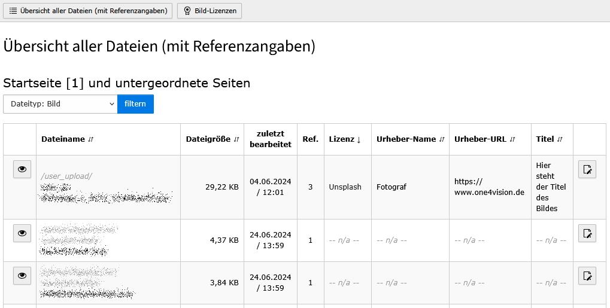

# TYPO3 extension ``imagecredits14v``


<!-- Generated with 🧡 at typo3-badges.dev -->

## What does it do?

The extension provides an overview of all images used on the website and displays their copyright information in the frontend. In the backend, a dedicated module lists all images in a table, allowing administrators to easily edit copyright details.

## Installation

### Installation using composer

The recommended way to install the extension is by using Composer. In your Composer based TYPO3 project root, just do

```bash
composer require one4vision/imagecredits14v
```

### Installation as extension from TYPO3 Extension Repository (TER)

Download and install the extension with the extension manager module.

## Plugin Configuration

The extension comes with two plugins

> Image-Credits :: Copyright  
> Image-Credits :: Metadata

### Plugin: Copyright   

---

Depending on the configuration, this plugin displays all images used in the TYPO3 system with details of the page and copyright information.

### `Nur aktuelle Seite (ohne Unterseite)`

If checked, only images from the page which contains the plugin will be displayed.  
If unchecked, the collector selects all images, up from the root page.

### `Referenzen aus Erweiterungen anzeigen`

By default, only images from the tables tt_content and pages are read. Here you can specify from which tables the images can still originate.
Only tables that can be found in the sys_file_reference table are specified.

### `Bilder in Liste anzeigen` 

If checked, the images are also displayed as a preview in the table.  
If unchecked, only the file name is visible.

### `Nur Dateien aus folgenden Verzeichnissen anzeigen`

Here you can specify directories (from fileadmin) in which the images to be displayed MUST be located.

### `Referenzen auf folgenden Seiten ignorieren`

If images are not to be displayed on certain pages (e.g. demo pages), these can be defined here.


### Plugin: Metadata

---

Depending on the plugin settings, all meta data of the images found are output via this plugin.  
 
If the site visitor is a logged-in backend user, the fields “Copyright information”, “Alternative text”, “Image caption” and “Download name” are delivered as form fields and can be edited directly in the frontend.

### `ID des Mandanten`

If the website consists of several clients, the client to be displayed can be specified here.

### `Nur Dateien aus folgenden Verzeichnissen)`

Here you can specify directories (from fileadmin) in which the images to be displayed MUST be located.

## Backend Module

The extension is delivered with a backend module "Datei-Metadaten". The module displays all images of the selected page and its subpages in a table. The list can be filtered by file type and sorted using the columns and provides a quick overview of the licenses and copyright information maintained.
The files can be edited directly from the list.





____

|                  | URL                                                    |
|------------------|--------------------------------------------------------|
| **Repository:**  | https://github.com/one4vision/imagecredits14v           |
| **TER:**         | https://extensions.typo3.org/extension/imagecredits14v |